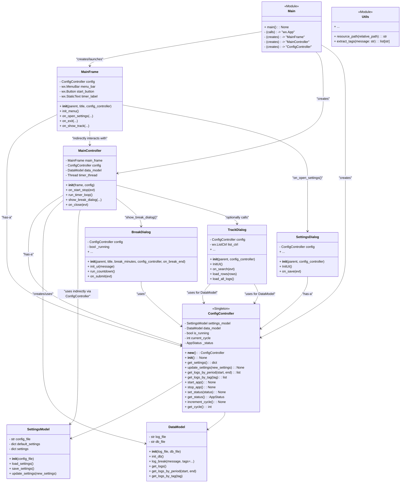

```mermaid

classDiagram

%%----------------------------------------------------------------------------------
%% 1) 메인 엔트리
%%----------------------------------------------------------------------------------
class Main {
    <<Module>>
    + main(): None
}
Main : - (calls) -> "wx.App"
Main : - (creates) -> "MainFrame"
Main : - (creates) -> "MainController"
Main : - (creates) -> "ConfigController"

%%----------------------------------------------------------------------------------
%% 2) Controllers
%%----------------------------------------------------------------------------------
class ConfigController {
    <<Singleton>>
    - SettingsModel settings_model
    - DataModel data_model
    - bool is_running
    - int current_cycle
    - AppStatus _status
    + __new__(): ConfigController
    + __init__(): None
    + get_settings(): dict
    + update_settings(new_settings): None
    + get_logs_by_period(start, end): list
    + get_logs_by_tag(tag): list
    + start_app(): None
    + stop_app(): None
    + set_status(status): None
    + get_status(): AppStatus
    + increment_cycle(): None
    + get_cycle(): int
}

class MainController {
    - MainFrame main_frame
    - ConfigController config
    - DataModel data_model
    - Thread timer_thread
    + __init__(frame, config)
    + on_start_stop(evt)
    + run_timer_loop()
    + show_break_dialog(...)
    + on_close(evt)
}

ConfigController --> SettingsModel
ConfigController --> DataModel

MainController  -->  ConfigController : "has-a"
MainController  -->  DataModel       : "creates/uses"
MainController  -->  SettingsModel   : "uses indirectly via ConfigController"

%%----------------------------------------------------------------------------------
%% 3) Models
%%----------------------------------------------------------------------------------
class SettingsModel {
    - str config_file
    - dict default_settings
    - dict settings
    + __init__(config_file)
    + load_settings()
    + save_settings()
    + update_settings(new_settings)
}

class DataModel {
    - str log_file
    - str db_file
    + __init__(log_file, db_file)
    + init_db()
    + log_break(message, tags=...)
    + get_logs()
    + get_logs_by_period(start, end)
    + get_logs_by_tag(tag)
}

%%----------------------------------------------------------------------------------
%% 4) Views
%%----------------------------------------------------------------------------------
class MainFrame {
    - ConfigController config
    - wx.MenuBar menu_bar
    - wx.Button start_button
    - wx.StaticText timer_label
    + __init__(parent, title, config_controller)
    + init_menu()
    + on_open_settings(...)
    + on_exit(...)
    + on_show_track(...)
}

class BreakDialog {
    - ConfigController config
    - bool _running
    + __init__(parent, title, break_minutes, config_controller, on_break_end)
    + init_ui(message)
    + run_countdown()
    + on_submit(evt)
    + ...
}

class TrackDialog {
    - ConfigController config
    - wx.ListCtrl list_ctrl
    + __init__(parent, config_controller)
    + InitUI()
    + on_search(evt)
    + load_rows(rows)
    + load_all_logs()
    + ...
}

class SettingsDialog {
    - ConfigController config
    + __init__(parent, config_controller)
    + InitUI()
    + on_save(evt)
    + ...
}

MainFrame       --> ConfigController : "has-a"
BreakDialog     --> ConfigController        : "uses"
TrackDialog     --> ConfigController        : "uses for DataModel"
SettingsDialog  --> ConfigController        : "has-a"

%%----------------------------------------------------------------------------------
%% 5) Utilities
%%----------------------------------------------------------------------------------
class Utils {
    <<Module>>
    + resource_path(relative_path): str
    + extract_tags(message: str): list[str]
    + ...
}

%%----------------------------------------------------------------------------------
%% 관계 정리
%%----------------------------------------------------------------------------------
Main --> MainFrame : "creates/launches"
Main --> MainController : "creates"
Main --> ConfigController : "creates"

MainFrame --> MainController : "indirectly interacts with"
MainController --> BreakDialog : "show_break_dialog()"
MainController --> TrackDialog : "optionally calls"
MainFrame --> SettingsDialog : "on_open_settings()"
TrackDialog --> ConfigController : "uses for DataModel"
```